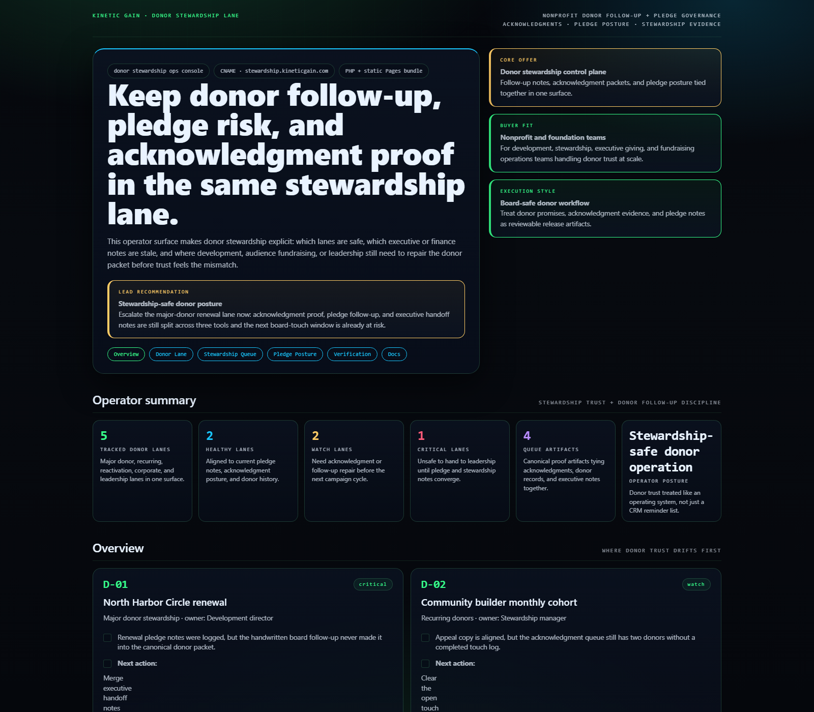
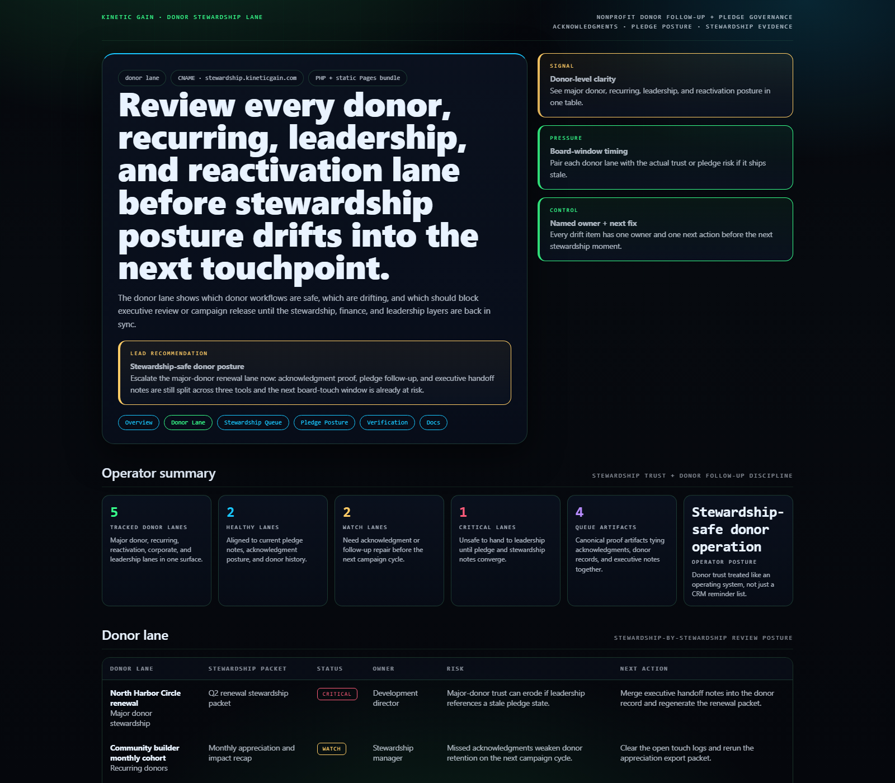
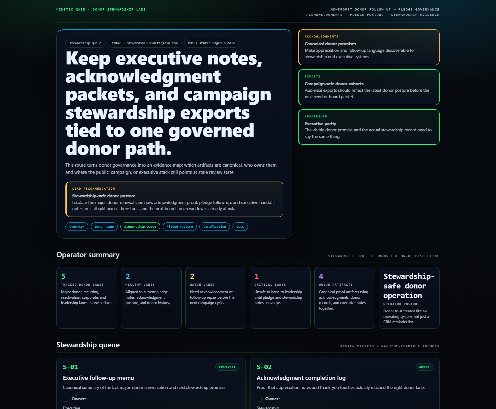
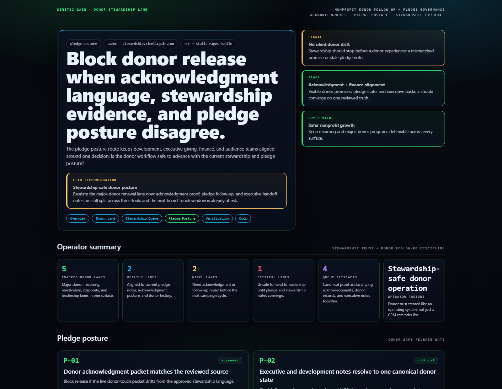

# Donor Stewardship Ops Console

WordPress and nonprofit control plane for donor follow-up, stewardship evidence, pledge-risk review, and acknowledgment-safe workflow posture.

## Why this exists

- Donor trust usually degrades when executive notes, stewardship packets, and campaign exports drift apart across too many tools.
- Development, finance, executive giving, and audience teams need one view of which donor lanes are safe, which pledge notes are stale, and which acknowledgments are still incomplete.
- Stewardship quality breaks when the donor packet, executive follow-up, and finance-safe pledge posture all say different things.

## Why this matters (KG Embedded tie-back)

This repo demonstrates the donor-stewardship primitive for Kinetic Gain Embedded: follow-up evidence, pledge posture, executive handoff notes, and campaign-safe donor routing exposed through one operator surface. In a real embedded setting, the same primitive lets nonprofits and foundations keep stewardship workflow, donor messaging, and finance-safe review aligned without shipping outreach changes blindly.

## Routes

- `/`
- `/donor-lane`
- `/stewardship-queue`
- `/pledge-posture`
- `/verification`
- `/docs`

## API

- `/api/dashboard/summary`
- `/api/donor-lane`
- `/api/stewardship-queue`
- `/api/verification`
- `/api/sample`

## Screenshots






## Local development

```powershell
cd donor-stewardship-ops-console
php -S 127.0.0.1:5442 .\router.php
```

Open:
- [http://127.0.0.1:5442/](http://127.0.0.1:5442/)
- [http://127.0.0.1:5442/donor-lane](http://127.0.0.1:5442/donor-lane)
- [http://127.0.0.1:5442/stewardship-queue](http://127.0.0.1:5442/stewardship-queue)
- [http://127.0.0.1:5442/pledge-posture](http://127.0.0.1:5442/pledge-posture)
- [http://127.0.0.1:5442/verification](http://127.0.0.1:5442/verification)

## Validation

- `php -l public\index.php`
- `php -l src\Services\DonorStewardshipOpsConsoleService.php`
- `php -l src\Views\render.php`
- `php -l plugin\donor-stewardship-ops-console.php`
- `php scripts\run_demo.php`
- `php scripts\prerender.php`
- `powershell -ExecutionPolicy Bypass -File .\scripts\smoke_check.ps1`
- `powershell -ExecutionPolicy Bypass -File .\scripts\render_readme_assets.ps1`

## Production status

| Aspect | Status |
|--------|--------|
| License | [AGPL-3.0-or-later](./LICENSE) |
| Security | [SECURITY.md](./SECURITY.md) |
| Deploy | Static prerender -> **https://stewardship.kineticgain.com/** |
| WordPress primitive | Donor stewardship snapshot shortcode + REST route |

## Docs

- [Architecture](./docs/architecture.md)
- [Origin](./docs/ORIGIN.md)
- [Kinetic Gain Embedded tie-back](./docs/KINETIC_GAIN_EMBEDDED.md)
- [Changelog](./CHANGELOG.md)

## Part of the Kinetic Gain Suite

Operator surface in the [Kinetic Gain Suite](https://suite.kineticgain.com/) — a portfolio of buyer-readable control planes spanning compliance evidence, nonprofit stewardship, property operations, FinOps, identity posture, and operator workflows. Apex: [kineticgain.com](https://kineticgain.com/).
